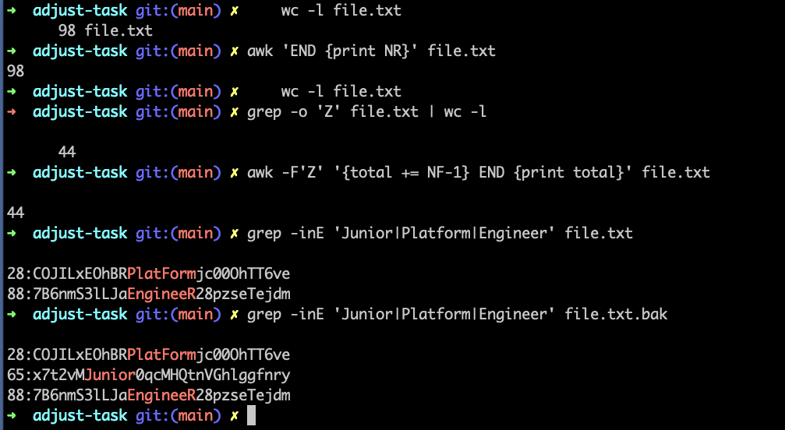
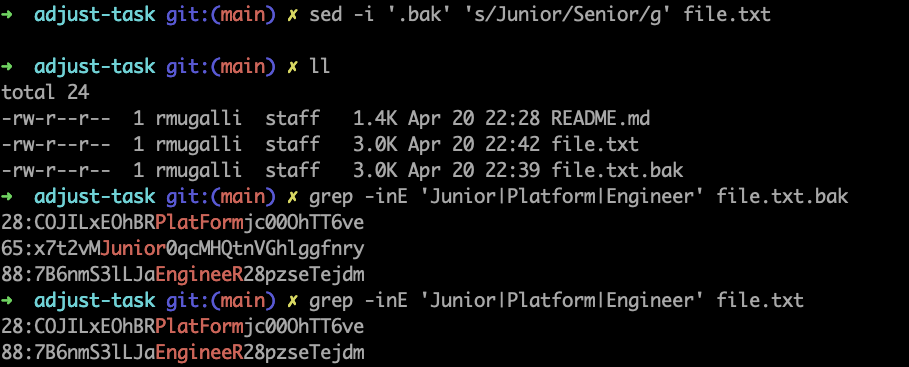

# adjust-task

## Task Descriptions

1. **Count the number of lines in a file. (How many lines in this file)**
2. **Count the number of times the character "Z" appears in a file.(How many “Z” Characters in this file )**
3. **Find the line numbers where the words "Junior", "Platform", and "Engineer" appear, regardless of case.**
4. **Replace the word "Junior" with "Senior" in a file, case-sensitively.** 

## Commands

### 1. Counting Lines in a File 
 - **Using `vim`:**  open the text file with vim Enter :set numebr to disply line numbers 

 - **Using `wc`:**  
 ```bash 
   wc -l file.txt 
```
####Result####
```bash
     97 file.txt
```     
 - **Using `awk`:** 
 ```bash 
      awk 'END {print NR}' file.txt 
```
####Result####
```bash
      98
 ```      
 ### 2 .Counting "Z" Characters in a File 
 - **Using `grep`: 
 ```bash 
  grep -o 'Z' file.txt | wc -l 
```
####Result####
```bash
    44 
 ```
 - **Using `awk`:**
 ```bash 
 awk -F'Z' '{total += NF-1} END {print total}' file.txt
```
####Result####
```bash
 44
```
### 3. Finding Specific Words on Lines
 - **Using `grep`:**  
 ```bash 
 grep -inE 'Junior|Platform|Engineer' file.txt
```
####Result####
```bash
28:COJILxEOhBRPlatFormjc00OhTT6ve
65:x7t2vMJunior0qcMHQtnVGhlggfnry
88:7B6nmS3lLJaEngineeR28pzseTejdm
 ```
 - **Using `awk`:** 
 ```bash 
 awk 'tolower($0) ~ /junior|platform|engineer/ {print NR ":" $0}' file.txt 
```
####Result####
```bash
 28:COJILxEOhBRPlatFormjc00OhTT6ve
65:x7t2vMJunior0qcMHQtnVGhlggfnry
88:7B6nmS3lLJaEngineeR28pzseTejdm
``` 
### 4. Replacing "Junior" with "Senior" in a File 
- **Using `sed`:** 
This command modifies the file and save a backup with .back extension 
```bash 
sed -i '.bak' 's/Junior/Senior/g' file.txt 
```
## Screenshots For Result: 





## Refrences : 
[awk builtin varable NF ](https://stackoverflow.com/questions/39895734/awk-built-in-variable-nf "awk NF") 


[awk builtin variable tolowe](https://www.oreilly.com/library/view/effective-awk-programming/0596000707/ch04.html " awk tolower")
